# in5PIRE

## Table of contents

* [Overview](#overview)
* [User Guide](#user-guide)
* [Community Feedback](#community-feedback)
* [Developer Guide](#developer-guide)
* [Development History](#development-history)
* [Continuous Integration](#continuous-integration)
* [Team](#team)

## Overview

in5PIRE is an ongoing project made for our partners at [Spire Hawaii LLP](https://www.spirehawaii.com/), designed to work with their business needs. This site will be updated frequently, following the development of this project. 

* [Meteor](https://www.meteor.com/) for Javascript-based implementation of client and server code.
* [React](https://reactjs.org/) for component-based UI implementation and routing.
* [React Bootstrap](https://react-bootstrap.github.io/) CSS Framework for UI design.
* [Uniforms](https://uniforms.tools/) for React and Semantic UI-based form design and display.

It also provides code that implements a variety of useful design concepts, including:

## User Guide

This section will provide a walkthrough of the in5PIRE user interface and its capabilities.

## Pages

Pages will be added here as they are created. This section will be updated continuously as pages change.

### Landing Page
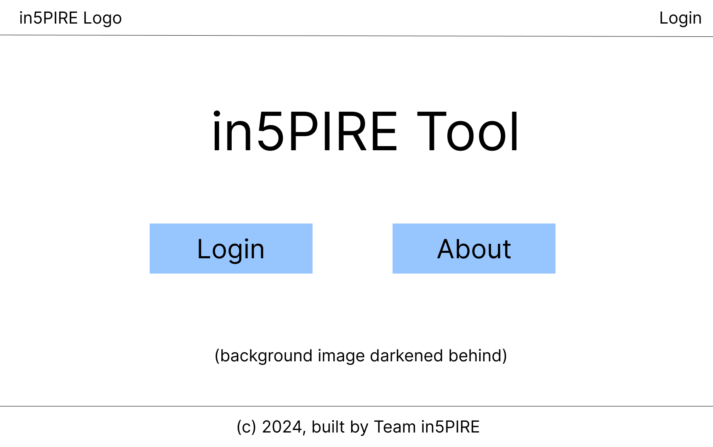
The first page that users see when they click into the site.

### Input Pages
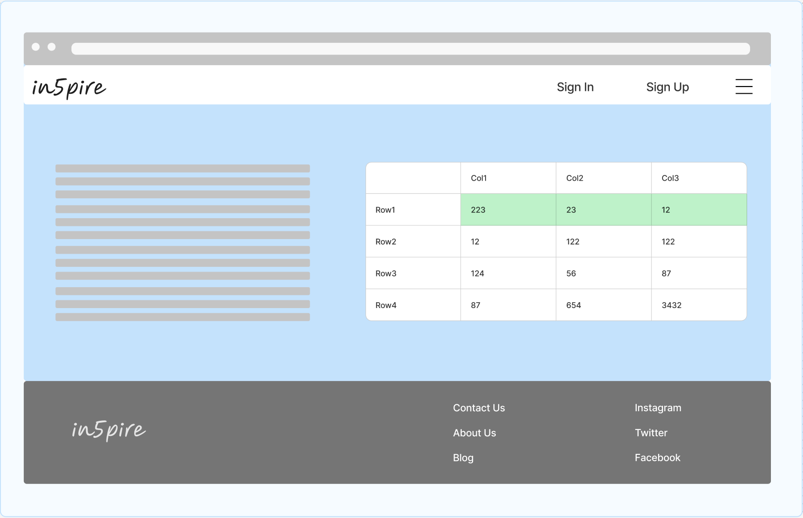
An early version of the input page including an excel-like component and possible tutorial text for new users, or information about the finacial model. The sheet will update as numbers are added by the user. 

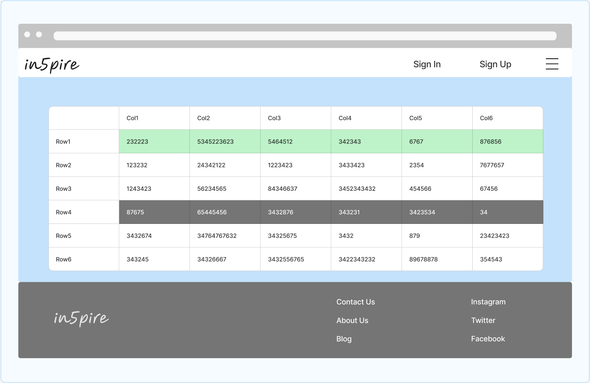
Another version of the input page without the side text. In the final version, the text may be able to fold into an expandable section that can be pulled out if the user needs it.

### Graph Pages 
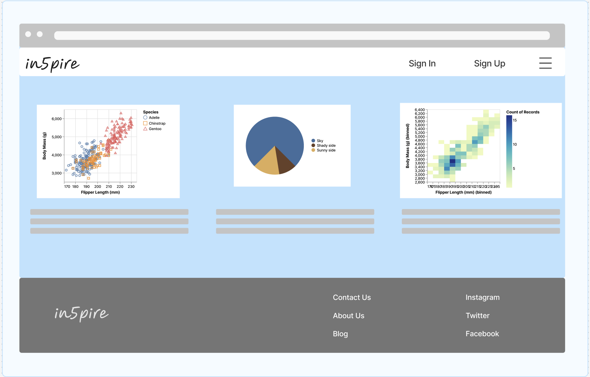
A mockup showcasing the different graphs that we could include for visualisation on each of the financial profiles that a user created. This could be an upper-level page that includes descriptions and links to the actual graphs, or could scroll down into each of the graphs. 

### View Your Financial Profiles Page
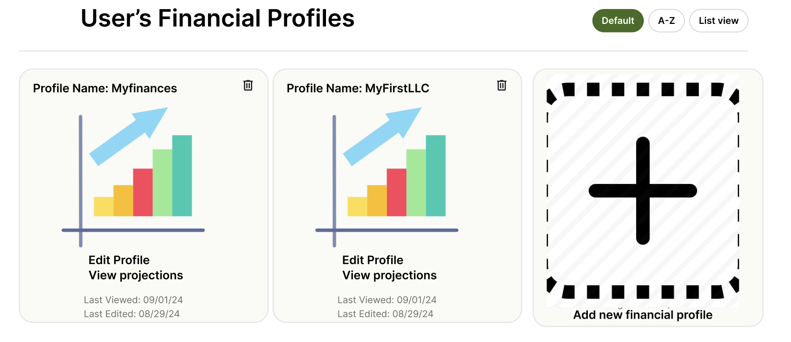
Users may want to have more than one financial profile at a time (e.g. a personal profile, business 1, business 2, etc.). The profiles will be in cards and give the users the chance to edit, view and delete profiles as well as displaying profile names and timestamps of last update/visit.

### About Page
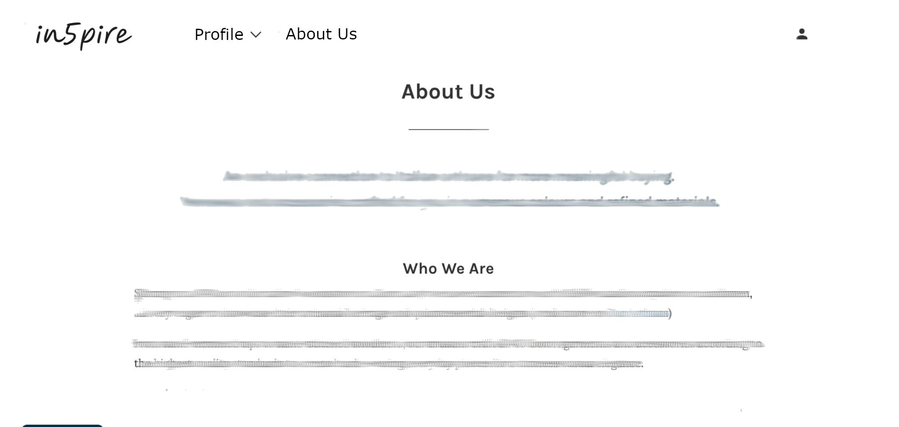
A quick visualization of what our About page will look like. This page will eventually be implemented with pictures of important members and contacts.

### FAQ Page
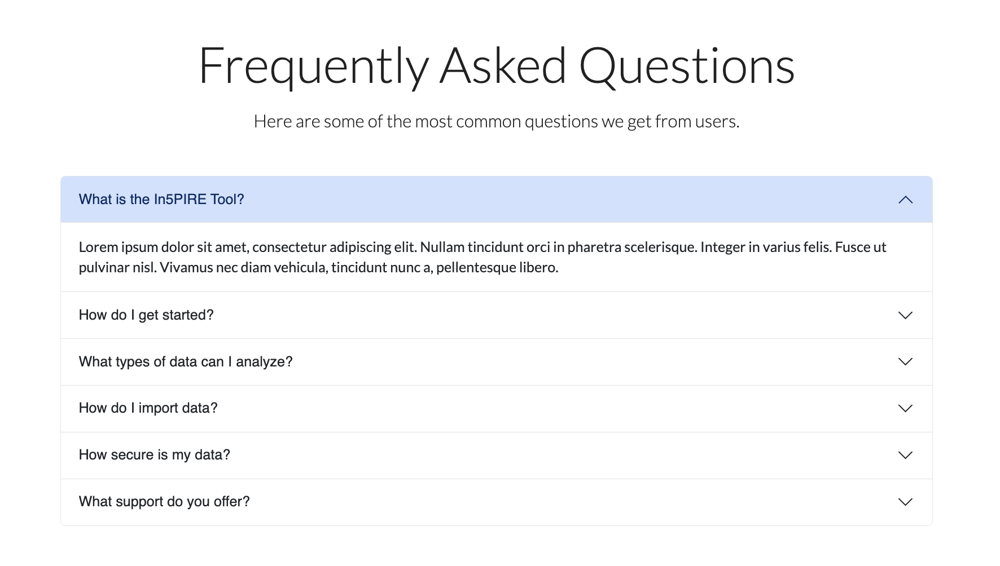
## Community Feedback

### Contact Us Page
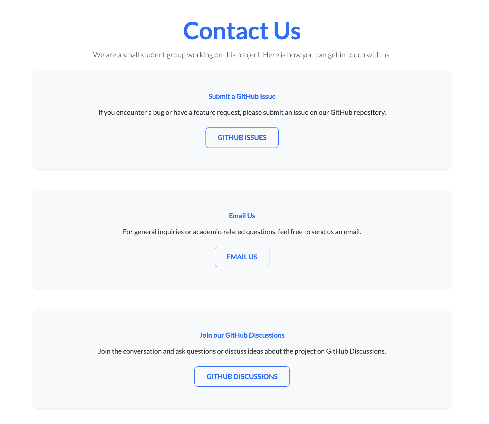

### User Guide Page
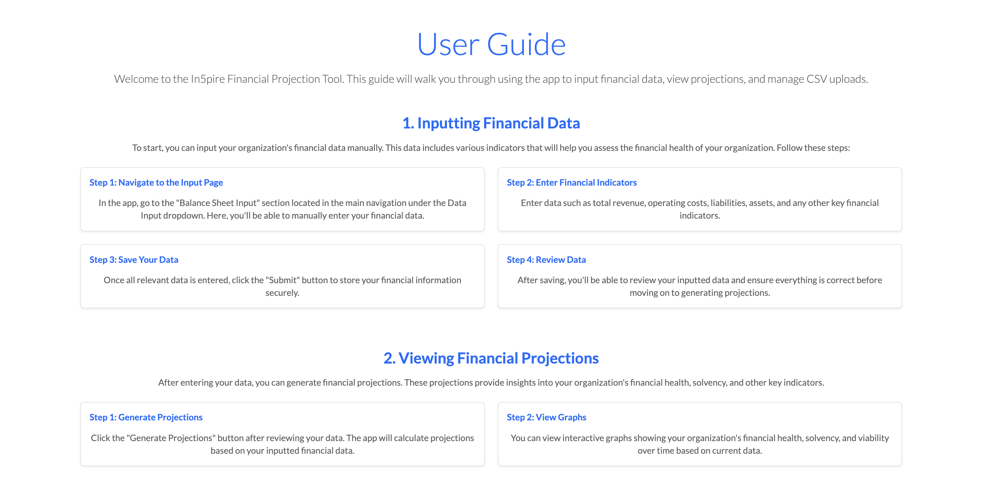
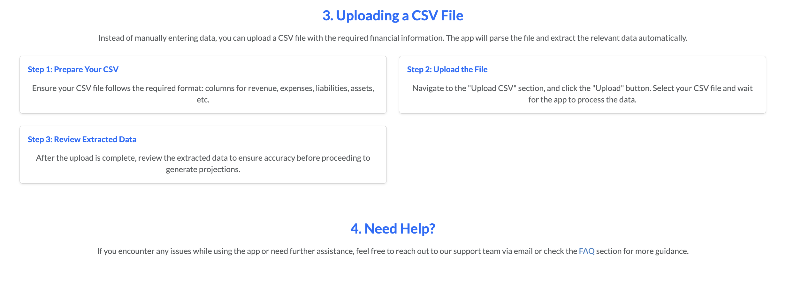

## Community Feedback

We are interested in your experience using in5PIRE! After project launch you can find our feedback form here. 

## Developer Guide

This section will provide information of interest to developers wishing to use this code base as a basis for their own developments.

### Installation

1. Begin by installing Meteor based on the instructions tailored to your operating system.
   
2. Go to [https://github.com/ICS-414-In5PIRE/in5PIRE-code.git](https://github.com/ICS-414-In5PIRE/in5PIRE-code), and click the "Use this template" button. Complete the dialog box to create a new repository that you own that is initialized with this template's files.
   
3. Now, go to your newly created repository, and click the "Clone or download" button to download your new GitHub repo to your local file system.  Using [GitHub Desktop](https://desktop.github.com/) is a great choice if you use MacOS or Windows.
   
4. After downloading the template to your local machine, navigate to the 'app/' directory using the
command line (cd) and install the necessary packages with the following command:

```
$ meteor npm install
```

5. Execute the system by running:

```
$ meteor npm run start
```
   
5. Assuming everything is configured correctly, the application should be accessible at http://localhost:3000.


#### ESLint

in5PIRE includes a [.eslintrc](https://github.com/bowfolios/bowfolios/blob/main/app/.eslintrc) file to define the coding style in this application. You can invoke ESLint from the command line as follows:

```
meteor npm run lint
```

Here is sample output indicating that no ESLint errors were detected:

```
$ meteor npm run lint

> bowfolios@ lint /Users/philipjohnson/github/bowfolios/bowfolios/app
> eslint --quiet --ext .jsx --ext .js ./imports ./tests

$
```

ESLint should run without generating any errors.

It's significantly easier to do development with ESLint integrated directly into your IDE (such as IntelliJ).

#### End to End Testing

in5PIRE uses [TestCafe](https://devexpress.github.io/testcafe/) to provide automated end-to-end testing.

## Continuous Integration

[](https://github.com/ICS-414-In5PIRE/in5PIRE-code/actions/workflows/ci.yml)

in5PIRE uses [GitHub Actions](https://docs.github.com/en/free-pro-team@latest/actions) to automatically run ESLint and TestCafe each time a commit is made to the default branch.

The workflow definition file is quite simple and is located at
[.github/workflows/ci.yml]().

## Development History

The development process for in5PIRE conformed to [Issue Driven Project Management](http://courses.ics.hawaii.edu/ics314f19/modules/project-management/) practices. In a nutshell:

* Development consists of a sequence of Milestones.
* Each Milestone is specified as a set of tasks.
* Each task is described using a GitHub Issue, and is assigned to a single developer to complete.
* Tasks should typically consist of work that can be completed in 2-4 days.
* The work for each task is accomplished with a git branch named "issue-XX", where XX is replaced by the issue number.
* When a task is complete, its corresponding issue is closed and its corresponding git branch is merged into master.
* The state (todo, in progress, complete) of each task for a milestone is managed using a GitHub Project Board.

The following sections document the development history of in5PIRE.

### Milestone 1: Mockup development
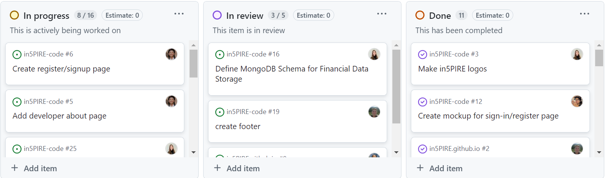
The main goal of Milestone 1 was to get familiarized with the environment and set goals in order to achieve what the customer wanted from the program. Most of the baseline was set during this milestone like the structure of the database, the frontend and the UI. 

This milestone ran from August 28 - September 11. You can view the project board for this milestone [here.](https://github.com/orgs/ICS-414-In5PIRE/projects/3)

### Milestone 2: Customer Milestone 1
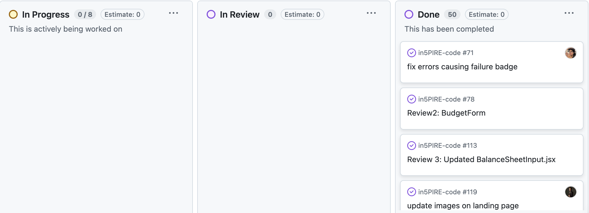
This was a big milestone considering this is the first meeting we were going to have with the customer. More mockups were created and implemented into the project, like the profiles page, sign-in/signup pages, and the main dashboard. 

This milestone ran from September 12 - October 2. You can view the project board for this milestone [here.](https://github.com/orgs/ICS-414-In5PIRE/projects/6/views/1)

### Milestone 3
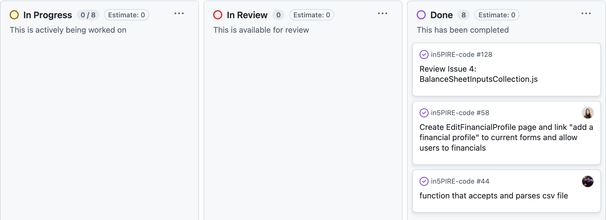
This was a small milestone since the last milestone was delayed by a week. Not much was done during this week long period and most of the progress was pushed to the next milestone. You can view the project board for this milestone [here.](https://github.com/orgs/ICS-414-In5PIRE/projects/7)

### Milestone 4: Customer Milestone 2

This was the milestone leading up to the second meeting with the customer. With the customer feedback we got from the last meeting, we improved the UI and added some features like two-factor authentication (2FA), graphs for the dashboard, and roles so that only admins can edit the financial data provided. 

This milestone ran from October 9 - October 23. You can view the project board for this milestone [here.](https://github.com/orgs/ICS-414-In5PIRE/projects/8/views/1)

### Milestone 5
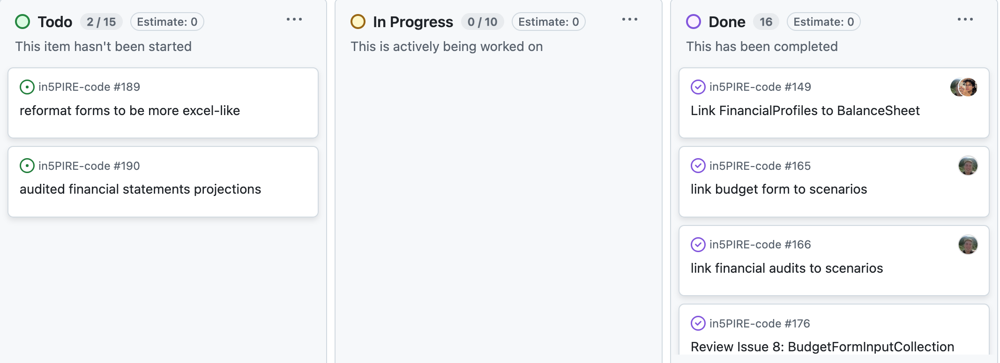
Most of the progress in this milestone were geared towards linking the imported data to the scenarios page and allowing the users to import and export data to the dashboard.

This milestone ran from October 24 - November 6. You can view the project board for this milestone [here.](https://github.com/orgs/ICS-414-In5PIRE/projects/9)

### Milestone 6: Customer Milestone 3
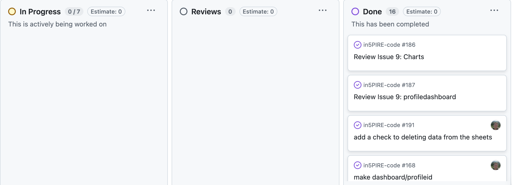
This milestone was mainly focused on linking the data with the projections and forecasts. Our graphs showed the 4 year, 8 year, and 12 year projections using the data that was provided by the user. We also implemented the projection formulas for the various different stats that are provided in the financial spreadsheets.

This milestone ran from November 7 - November 20. You can view the project board for this milestone [here.](https://github.com/orgs/ICS-414-In5PIRE/projects/10/views/1)

### Milestone 7: Customer Milestone 4
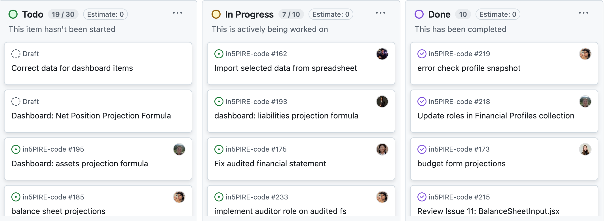
This is the final milestone lasting over a month after the 3rd meeting with our customer. Most of the focus was adding roles, finishing and polishing the snapshots and dashboard, and correcting the projections data. 

This milestone ran from November 21 - December 11. You can view the project board for this milestone [here.](https://github.com/orgs/ICS-414-In5PIRE/projects/11/views/1)

## Team

in5PIRE is a group project designed, implemented, and maintained by Emily Hsu, Zachary Stoddard, Shedrick Klifford Ulibas, Dao McGill, Brayden Danielson, Bobby Roth, Luke Pagtulingan, and Sean Sunoo.
